# D-Racer-Kit 전체 패키지 구조 & 유기적 관계 가이드

> 1/10 스케일 자율주행 대회용 차량 — TOPST D3-G (TCC8050) 기반

---

## 목차

1. [시스템 전체 아키텍처](#1-시스템-전체-아키텍처)
2. [패키지 목록 한눈에 보기](#2-패키지-목록-한눈에-보기)
3. [하드웨어 ↔ 패키지 매핑](#3-하드웨어--패키지-매핑)
4. [각 패키지 상세 설명](#4-각-패키지-상세-설명)
5. [ROS2 토픽 & 메시지 총정리](#5-ros2-토픽--메시지-총정리)
6. [Launch 파일별 노드 구성](#6-launch-파일별-노드-구성)
7. [bisa 내부 모듈 관계도](#7-bisa-내부-모듈-관계도)
8. [데이터 흐름 시나리오](#8-데이터-흐름-시나리오)

---

## 1. 시스템 전체 아키텍처

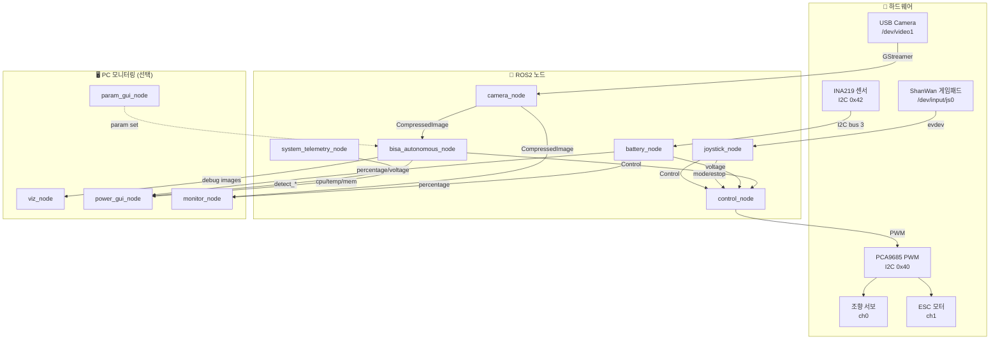

---

## 2. 패키지 목록 한눈에 보기

| 패키지 | 유형 | 역할 | 수정 가능 |
|---|---|---|---|
| **bisa** | 실행 노드 | 🧠 자율주행 두뇌 (인식+FSM+제어 출력) | ✅ |
| **camera** | 실행 노드 | 📷 카메라 캡처 & 퍼블리시 | ❌ |
| **control** | 실행 노드 | 🎛️ PWM 서보/모터 제어 | ❌ |
| **joystick** | 실행 노드 | 🎮 게임패드 입력 처리 | ❌ |
| **battery** | 실행 노드 | 🔋 배터리 전압/잔량 측정 | ❌ |
| **monitor** | 실행 노드 | 🌐 Flask 웹 대시보드 | ❌ |
| **topst_utils** | 라이브러리 | 🔌 I2C/PCA9685 하드웨어 유틸 | ❌ |
| **config** | 데이터 | ⚙️ 공유 하드웨어 캘리브레이션 YAML | ❌ |
| **control_msgs** | 메시지 | 📨 `Control.msg` 정의 | ❌ |
| **joystick_msgs** | 메시지 | 📨 `Joystick.msg` 정의 (레거시) | ❌ |
| **battery_msgs** | 메시지 | 📨 `Battery.msg` 정의 (레거시) | ❌ |

> [!NOTE]
> ❌ 패키지는 사용자 허락 없이 수정 불가 (프로젝트 규칙). 읽기는 항상 가능.

---

## 3. 하드웨어 ↔ 패키지 매핑

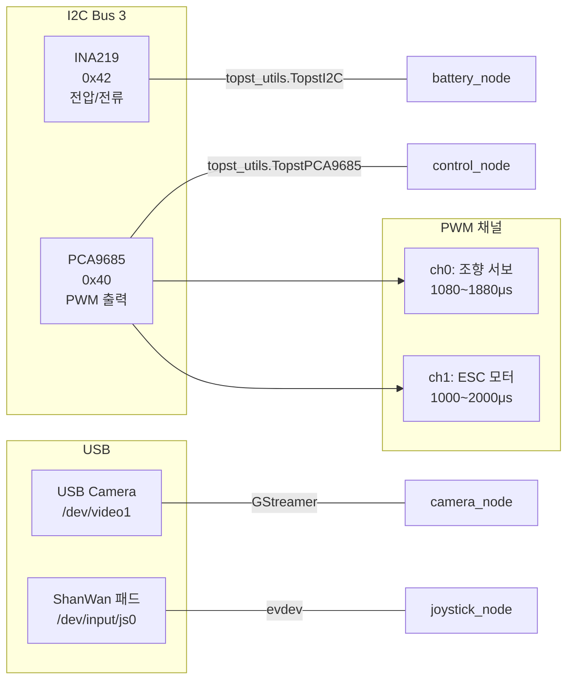

| 하드웨어 | I2C/장치 | 담당 패키지 | 유틸 클래스 |
|---|---|---|---|
| INA219 (배터리 센서) | Bus 3, Addr `0x42` | `battery` | `TopstI2C` |
| PCA9685 (PWM 드라이버) | Bus 3, Addr `0x40` | `control` | `TopstPCA9685` |
| 조향 서보 | PCA ch0, 1080~1880μs | `control` | — |
| ESC (스로틀) | PCA ch1, 1000~2000μs | `control` | — |
| USB 카메라 | `/dev/video1`, 640×480 | `camera` | GStreamer |
| ShanWan 게임패드 | `/dev/input/js0` | `joystick` | evdev |

---

## 4. 각 패키지 상세 설명

### 4.1 `bisa` — 🧠 자율주행 두뇌

자율주행의 **모든 연산**을 담당하는 핵심 패키지.

| 소스 파일 | 역할 |
|---|---|
| [autonomous_driving_node.py](file:///home/hyun/D-Racer-Kit/src/bisa/src/autonomous_driving_node.py) | **메인 ROS2 노드**. 카메라 구독 → 차선인식 + YOLO 추론 + FSM → /control 퍼블리시. MultiThreadedExecutor 3스레드 + 추론 데몬 스레드 |
| [object_detector.py](file:///home/hyun/D-Racer-Kit/src/bisa/src/object_detector.py) | **YOLO 추론 래퍼**. NCNN/PyTorch 모델 로드, Vulkan/CUDA/CPU 디바이스 선택, ROI 게이팅, 시간적 투표 버퍼 |
| [lane_perception.py](file:///home/hyun/D-Racer-Kit/src/bisa/src/lane_perception.py) | **차선 인식** (고전적 비전). LAB 색공간 → CLAHE → 이진화 → 형태학 → 허프 라인 → 중심 오차/곡률 |
| [mission_controller.py](file:///home/hyun/D-Racer-Kit/src/bisa/src/mission_controller.py) | **미션 FSM + 제어 출력**. 순수추종 조향 + 스로틀 매핑 + 코스별 상태 머신 |
| [traffic_light.py](file:///home/hyun/D-Racer-Kit/src/bisa/src/traffic_light.py) | **신호등 색 분류**. YOLO 박스를 세로 3등분 → 상단(빨강)/하단(초록) 색 비율로 판정. 3가지 분류기 (color/lit/lab) |
| [aruco_detector.py](file:///home/hyun/D-Racer-Kit/src/bisa/src/aruco_detector.py) | **ArUco 마커 검출**. `DICT_6X6_50` 사전, target_id=3 보이면 즉시 정지 |
| [dracer_config.py](file:///home/hyun/D-Racer-Kit/src/bisa/src/dracer_config.py) | **설정 시스템**. 10개 dataclass(ROI/차선/검출기/스로틀/조향/미션 등) + YAML 로딩 |
| [visualization.py](file:///home/hyun/D-Racer-Kit/src/bisa/src/visualization.py) | **디버그 오버레이** 그리기. 검출 박스, 차선, FSM 상태, 게이지 |
| [viz_node.py](file:///home/hyun/D-Racer-Kit/src/bisa/src/viz_node.py) | **PC용 뷰어 노드**. 디버그 이미지를 OpenCV 윈도우로 표시 |
| [power_gui_node.py](file:///home/hyun/D-Racer-Kit/src/bisa/src/power_gui_node.py) | **전원/시스템 GUI**. Tkinter 대시보드 — 배터리, CPU, 온도, 검출 상태 |
| [system_telemetry_node.py](file:///home/hyun/D-Racer-Kit/src/bisa/src/system_telemetry_node.py) | **차량 시스템 모니터**. /proc에서 CPU/메모리/온도 읽어 퍼블리시 |
| [param_gui_node.py](file:///home/hyun/D-Racer-Kit/src/bisa/src/param_gui_node.py) | **라이브 파라미터 튜닝 GUI**. Tkinter 슬라이더로 dracer_params 실시간 조정 |
| [dash_line_tuner.py](file:///home/hyun/D-Racer-Kit/src/bisa/src/dash_line_tuner.py) | **차선 검출 튜너**. OpenCV 트랙바로 LAB/허프 파라미터 실시간 조정 |

### 4.2 `camera` — 📷 카메라 노드

| 항목 | 내용 |
|---|---|
| 역할 | GStreamer로 USB/MIPI 카메라 캡처 → JPEG 인코딩 → CompressedImage 퍼블리시 |
| 소스 | [camera_node.py](file:///home/hyun/D-Racer-Kit/src/camera/src/camera_node.py), [camera_utils.py](file:///home/hyun/D-Racer-Kit/src/camera/src/camera_utils.py) |
| 퍼블리시 | `/camera/image/compressed` (CompressedImage) |
| 주요 파라미터 | `camera_type`=usb, `device_path`=/dev/video1, `width`=640, `height`=480, `publish_hz`=30.0 |

### 4.3 `control` — 🎛️ 서보/모터 제어

| 항목 | 내용 |
|---|---|
| 역할 | `/control` 토픽의 정규화된 steering/throttle → PCA9685 PWM 출력 변환 |
| 소스 | [control_node.py](file:///home/hyun/D-Racer-Kit/src/control/src/control_node.py), [power_guard.py](file:///home/hyun/D-Racer-Kit/src/control/src/power_guard.py) |
| 구독 | `/control` (Control), `/joystick/control` (Control), `/battery/voltage` (Float32) |
| PWM 매핑 | 조향: 중심 1480μs ± 400μs / 스로틀: 중립 1500μs, 전진 1500~2000μs |
| 전압 가드 | 6.5V 이하에서 스로틀 스케일 다운, 6.2V에서 최소 스케일 0.75 |

### 4.4 `joystick` — 🎮 게임패드 입력

| 항목 | 내용 |
|---|---|
| 역할 | ShanWan 게임패드에서 조향/스로틀/모드/비상정지 입력 처리 |
| 소스 | [joystick_node.py](file:///home/hyun/D-Racer-Kit/src/joystick/src/joystick_node.py) |
| 퍼블리시 | `/joystick/control` (Control), `/joystick/mode` (String), `/joystick/estop` (Bool) |
| 버튼 맵 | A: AUTO/MANUAL 토글, X: 비상정지, 왼쪽 스틱: 조향+스로틀 |

### 4.5 `battery` — 🔋 배터리 모니터

| 항목 | 내용 |
|---|---|
| 역할 | INA219 센서에서 전압/전류 읽어 배터리 잔량 계산 & 퍼블리시 |
| 소스 | [battery_node.py](file:///home/hyun/D-Racer-Kit/src/battery/src/battery_node.py) |
| 퍼블리시 | `/battery/percentage` (Float32, 0~100%), `/battery/voltage` (Float32, V) |
| 매핑 | 6.4V = 0%, 8.4V = 100% (2S LiPo 선형) |

### 4.6 `monitor` — 🌐 웹 대시보드

| 항목 | 내용 |
|---|---|
| 역할 | Flask 웹서버로 카메라 스트림, 배터리, 제어 상태를 브라우저에서 확인 |
| 소스 | [monitor_node.py](file:///home/hyun/D-Racer-Kit/src/monitor/src/monitor_node.py) |
| 구독 | `/camera/image/compressed`, `/battery/percentage`, `/joystick/control` |
| 엔드포인트 | `http://<ip>:5555/` (대시보드), `/video_feed` (MJPEG), `/status` (JSON) |

### 4.7 `topst_utils` — 🔌 하드웨어 유틸

| 항목 | 내용 |
|---|---|
| 역할 | TOPST 보드 I2C 통신 & PCA9685 PWM 드라이버 래퍼 (라이브러리, 노드 없음) |
| 클래스 | `TopstI2C` (smbus2 래퍼), `TopstPCA9685` (PWM 드라이버) |
| 사용처 | `battery` 패키지, `control` 패키지 |

### 4.8 `config` — ⚙️ 공유 설정

| 항목 | 내용 |
|---|---|
| 역할 | 하드웨어 캘리브레이션 YAML 파일 저장 (노드 없음, 데이터 전용) |
| 핵심 파일 | `d3racer.yaml` (서보/ESC/카메라/I2C 설정), `calibration.yaml` (조향 트림) |

### 4.9 메시지 패키지들

| 패키지 | 메시지 | 필드 | 비고 |
|---|---|---|---|
| `control_msgs` | `Control.msg` | `Header header`, `float32 steering`, `float32 throttle` | **핵심 메시지** — 시스템 전체가 사용 |
| `joystick_msgs` | `Joystick.msg` | `Header`, steering, throttle, estop, mode | 레거시 (현재 미사용) |
| `battery_msgs` | `Battery.msg` | voltage, current, percentage | 레거시 (현재 미사용) |

---

## 5. ROS2 토픽 & 메시지 총정리

### 퍼블리시 토픽

| 토픽 | 메시지 타입 | 퍼블리셔 | 구독자 |
|---|---|---|---|
| `/camera/image/compressed` | CompressedImage | camera_node | **bisa**, monitor |
| `/battery/percentage` | Float32 | battery_node | monitor, power_gui |
| `/battery/voltage` | Float32 | battery_node | **control_node** (전압가드), power_gui |
| `/joystick/control` | Control | joystick_node | control_node |
| `/joystick/mode` | String | joystick_node | (모니터링용) |
| `/joystick/estop` | Bool | joystick_node | (모니터링용) |
| `/control` | Control | **bisa** | **control_node** |
| `/system/cpu_usage` | Float32 | system_telemetry | power_gui |
| `/system/cpu_temp` | Float32 | system_telemetry | power_gui |
| `/system/memory_usage` | Float32 | system_telemetry | power_gui |
| `detect_green` | Bool | **bisa** | power_gui |
| `detect_red` | Bool | **bisa** | power_gui |
| `detect_sign` | String | **bisa** | power_gui |
| `detect_aruco` | String | **bisa** | power_gui |
| `/bisa/debug/image/compressed` | CompressedImage | **bisa** | viz_node |
| `/bisa/debug/lane_mask/compressed` | CompressedImage | **bisa** | viz_node |

### 데이터 흐름도

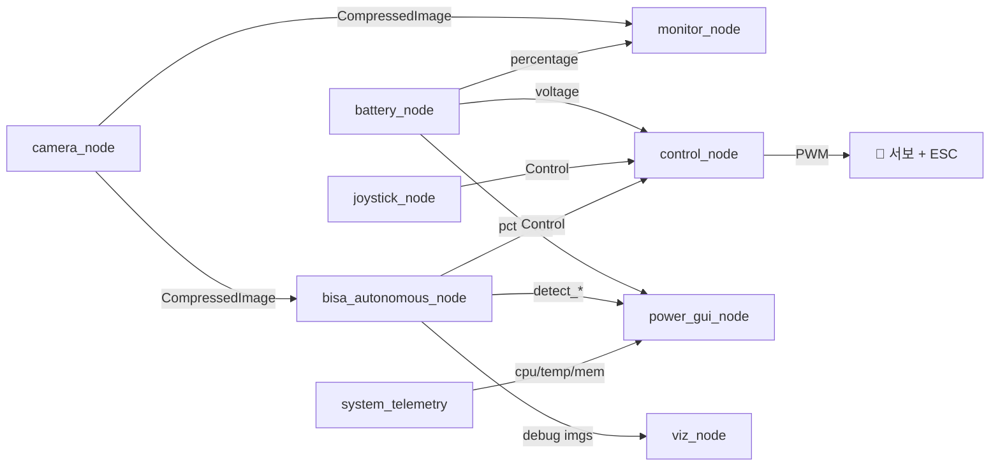

---

## 6. Launch 파일별 노드 구성

### 6.1 `onboard.launch.py` — 🏎️ 차량 단독 주행 (대회 모드)

> WiFi 없이 차량 혼자 모든 연산. **대회에서 사용하는 메인 launch.**

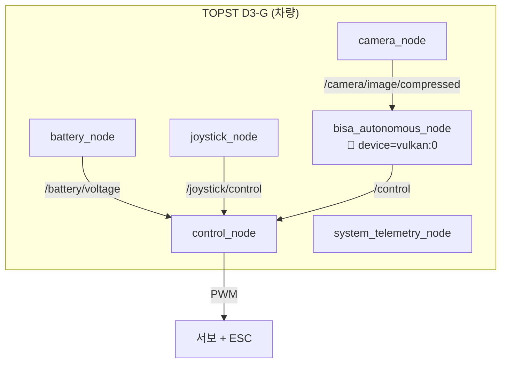

| 설정 | 값 | 의미 |
|---|---|---|
| model | `best_ncnn_model` | NCNN 포맷 |
| device | `vulkan:0` | PowerVR GPU |
| imgsz | 320 | NCNN 내보내기 해상도 |
| inference_hz | 8.0 | GPU 추론 상한 |
| publish_debug_image | false | 헤드리스 차량 |

### 6.2 `vehicle.launch.py` + `driving.launch.py` — 🔗 PC 연동 모드

> 차량은 카메라/제어만, PC가 자율주행 연산 (튜닝/개발용)

````carousel
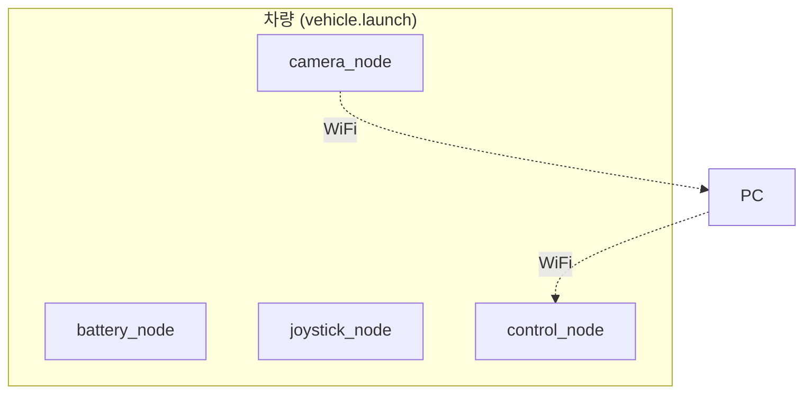
<!-- slide -->
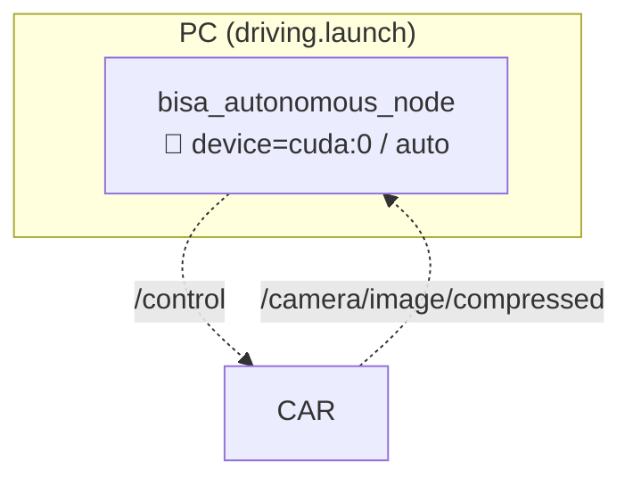
````

### 6.3 `debug.launch.py` — 🖥️ PC 모니터링/튜닝

> PC에서 viz_node, power_gui, param_gui 실행

---

## 7. bisa 내부 모듈 관계도

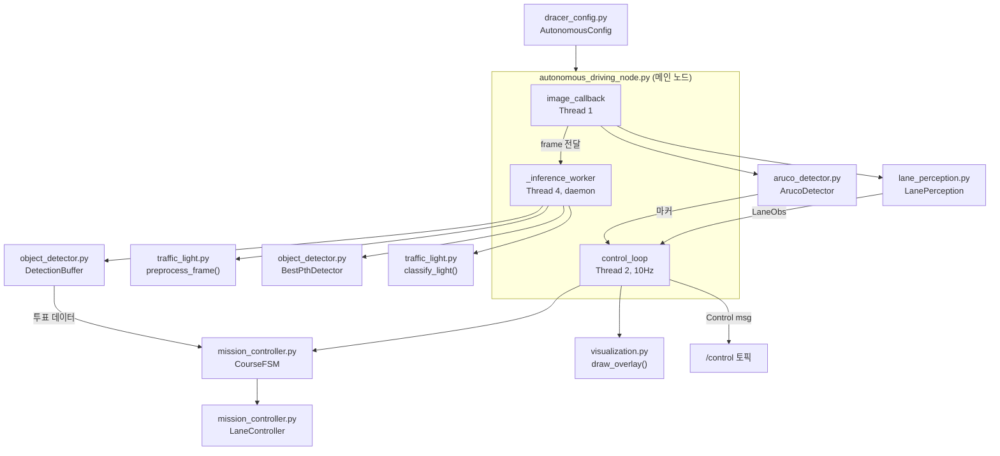

### bisa 스레딩 구조

| 스레드 | 콜백그룹 | 역할 | 주기 |
|---|---|---|---|
| Thread 1 | `_cb_image` (MutuallyExclusive) | 카메라 프레임 수신 → 차선 인식 + ArUco + 프레임 전달 | 카메라 프레임마다 |
| Thread 2 | `_cb_control` (MutuallyExclusive) | FSM 스텝 → /control 퍼블리시 + 디버그 오버레이 | 10 Hz |
| Thread 3 | Default | ROS2 내부 (파라미터 서비스 등) | — |
| Thread 4 | (daemon) | YOLO 추론 (무거운 연산을 분리) | inference_hz 상한 |

---

## 8. 데이터 흐름 시나리오

### 시나리오 A: 초록불 → 출발

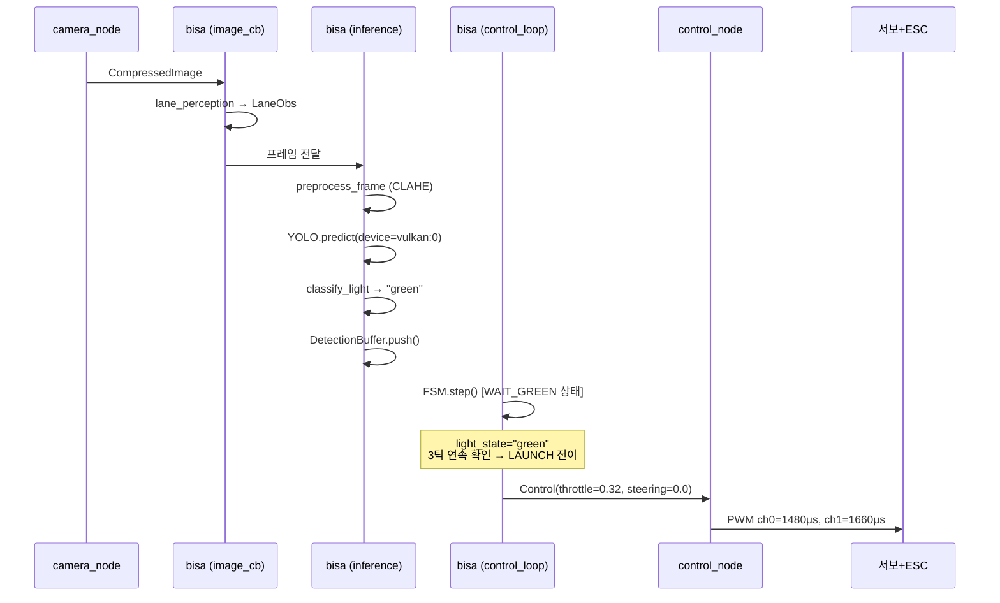

### 시나리오 B: 갈림길 표지판

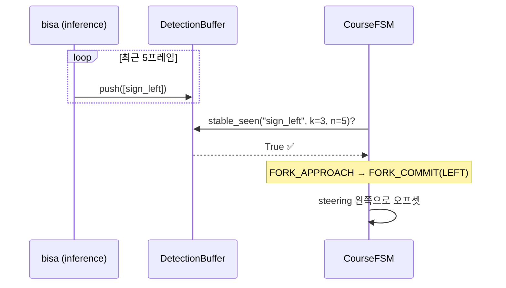

### 시나리오 C: 배터리 전압 가드

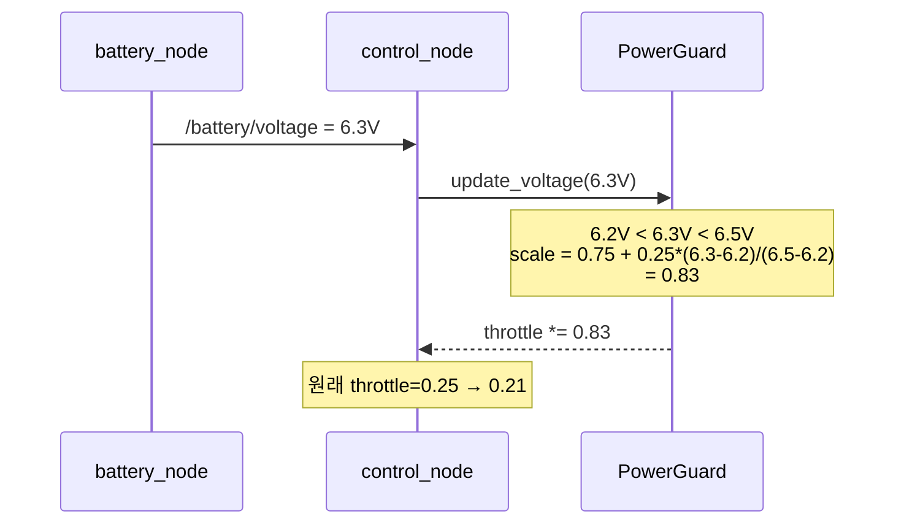

---

## 패키지 의존성 그래프 (요약)

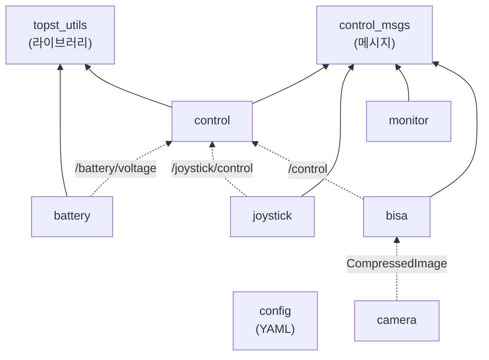

> [!TIP]
> **핵심 요약**: `camera_node`가 영상을 쏘면 → `bisa`가 차선+YOLO+FSM을 돌려서 → `/control` 토픽으로 명령을 보내면 → `control_node`가 PCA9685 PWM을 써서 서보/모터를 움직입니다. `battery_node`는 전압을 감시하고, `joystick_node`는 수동 조작과 비상정지를 담당합니다.
